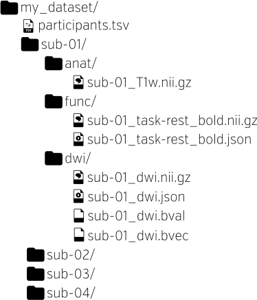

class: center middle

# BIDS Apps Metadata
### Christopher J. Markiewicz
#### Center for Reproducible Neuroscience
#### Stanford University

###### [effigies.github.io/bids-metadata](https://effigies.github.io/bids-metadata)

---
name: footer
layout: true

MONII - Montreal, QC - Mar 2019

---
layout: true
template: footer
name: BIDS

# BIDS: Brain Imaging Data Structure

---
layout: true
template: BIDS

.pull-left[]

---

.pull-right[
* BIDS is a directory structure, not a binary format

* Builds on existing standards (NIfTI, JSON, TSV)

* Intended for human *and* machine legibility

* The [BIDS Validator](https://bids-standard.github.io/bids-validator)
  makes compliance easy to verify

* The [specification](https://bids-specification.readthedocs.io/en/stable/)
  is a searchable HTML document
]

---

.pull-right[

* Basic metadata in the file names

  * Subject, session, imaging modality, etc.
  * Generally just enough to assign unique names

]

---
count: false

.pull-right[
* Basic metadata in the file names
  * Subject, session, imaging modality, etc.
  * Generally just enough to assign unique names

* [`dataset_description.json`](https://bids-specification.readthedocs.io/en/stable/03-modality-agnostic-files.html#dataset_descriptionjson),
  [`participants.tsv`](https://bids-specification.readthedocs.io/en/stable/03-modality-agnostic-files.html#participants-file),
  [`sessions.tsv`](https://bids-specification.readthedocs.io/en/stable/05-longitudinal-and-multi-site-studies.html#sessions-file),
  and [`scans.tsv`](https://bids-specification.readthedocs.io/en/stable/03-modality-agnostic-files.html#scans-file)
  record study-level metadata that may not be associated
  with specific images
]

---
count: false

.pull-right[
* Basic metadata in the file names
  * Subject, session, imaging modality, etc.
  * Generally just enough to assign unique names

* [`dataset_description.json`](https://bids-specification.readthedocs.io/en/stable/03-modality-agnostic-files.html#dataset_descriptionjson),
  [`participants.tsv`](https://bids-specification.readthedocs.io/en/stable/03-modality-agnostic-files.html#participants-file),
  [`sessions.tsv`](https://bids-specification.readthedocs.io/en/stable/05-longitudinal-and-multi-site-studies.html#sessions-file),
  and [`scans.tsv`](https://bids-specification.readthedocs.io/en/stable/03-modality-agnostic-files.html#scans-file)
  record study-level metadata that may not be associated
  with specific images

* NIfTI headers and JSON sidecars contain detailed,
  image-related metadata
]

---
count: false

.pull-right[
* Basic metadata in the file names
  * Subject, session, imaging modality, etc.
  * Generally just enough to assign unique names

* [`dataset_description.json`](https://bids-specification.readthedocs.io/en/stable/03-modality-agnostic-files.html#dataset_descriptionjson),
  [`participants.tsv`](https://bids-specification.readthedocs.io/en/stable/03-modality-agnostic-files.html#participants-file),
  [`sessions.tsv`](https://bids-specification.readthedocs.io/en/stable/05-longitudinal-and-multi-site-studies.html#sessions-file),
  and [`scans.tsv`](https://bids-specification.readthedocs.io/en/stable/03-modality-agnostic-files.html#scans-file)
  record study-level metadata that may not be associated
  with specific images

* NIfTI headers and JSON sidecars contain detailed,
  image-related metadata

* [Converters](https://bids.neuroimaging.io/#software) make
  populating metadata as painless as possible
]

